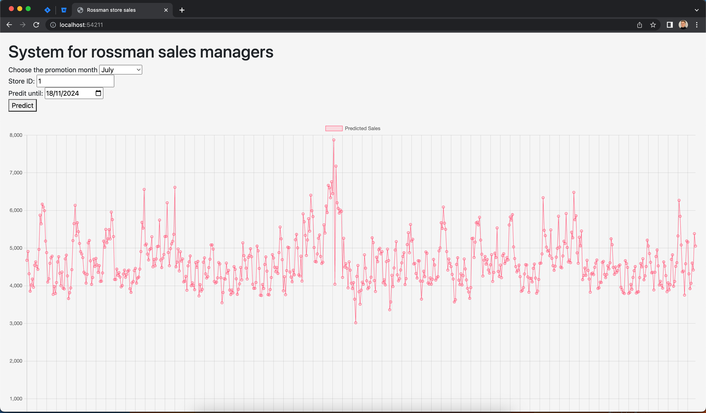

# README

Team project. It is worked by 5 team members together.

1. I responsible for the XGBoost model which is used as final model.
2. I also responsible for all design of optimization of projects which help to improve the RSMPE of the our project from 0.136 to 0.057.

(Front-end is built by other team member)
